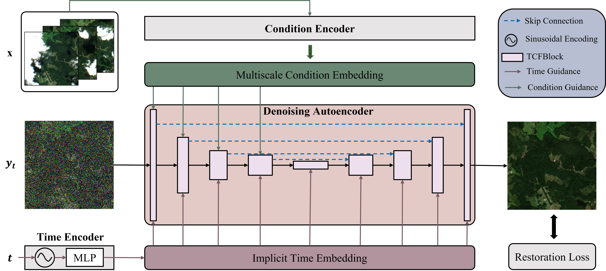

<div align="center">
<h1 align="center">DiffCR: A Fast Conditional Diffusion Framework for Cloud Removal from Optical Satellite Images</h1>
<p align="center">This repository is the official PyTorch implementation of the TGRS 2024 paper DiffCR.</p>

[](https://arxiv.org/abs/2308.04417)
[](https://xavierjiezou.github.io/DiffCR/)
[](https://huggingface.co/XavierJiezou/diffcr-models)
[](https://huggingface.co/datasets/XavierJiezou/diffcr-datasets)



</div>

**Thank you all for your attention to our work. I'm sorry for not responding quickly. Shortly, possibly within a month, we will specifically allocate time to organize all files related to the paper and open-source everything that can be open-sourced, including code, datasets, pre-trained models, and even visualization results, etc. Thank you again for your attention.**

## Requirements

To install dependencies:

```bash
pip install -r requirements.txt
```

<!-- >📋  Describe how to set up the environment, e.g. pip/conda/docker commands, download datasets, etc... -->

To download datasets:

- Sen2_MTC_Old: [multipleImage.tar.gz](https://doi.org/10.7910/DVN/BSETKZ)

- Sen2_MTC_New: [CTGAN.zip](https://drive.google.com/file/d/1-hDX9ezWZI2OtiaGbE8RrKJkN1X-ZO1P/view?usp=share_link)

- SEN12MS-CR: [https://mediatum.ub.tum.de/1554803](https://mediatum.ub.tum.de/1554803)

## Training

To train the models in the paper, run these commands:

```train
python run.py -p train -c config/ours_sigmoid.json
```

<!-- >📋  Describe how to train the models, with example commands on how to train the models in your paper, including the full training procedure and appropriate hyperparameters. -->

## Testing

To test the pre-trained models in the paper, run these commands:

```bash
python run.py -p test -c config/ours_sigmoid.json
```

## Evaluation

To evaluate my models on two datasets, run:

```bash
python evaluation/eval.py -s [ground-truth image path] -d [predicted-sample image path]
```

<!-- >📋  Describe how to evaluate the trained models on benchmarks reported in the paper, give commands that produce the results (section below). -->

## Pretrained Model Weights

You can download pretrained models here:

- DiffCR trained on Sen2_MTC_Old dataset: [🤗 HuggingFace](https://huggingface.co/XavierJiezou/diffcr-models/tree/main/experiments/train_nafnet_double_encoder_splitcaCond_splitcaUnet_sigmoid_old_5000_230624_144530)
- DiffCR trained on Sen2_MTC_New dataset: [🤗 HuggingFace](https://huggingface.co/XavierJiezou/diffcr-models/tree/main/experiments/train_nafnet_double_encoder_splitcaCond_splitcaUnet_sigmoid_noisen3_230611_035949)
- DiffCR trained on SEN12MS-CR dataset (based on the official open-source implementation of UnCRtainTS): [🤗 HuggingFace](https://huggingface.co/XavierJiezou/diffcr-models/tree/main/UnCRtainTS)

## Visualization

The visualization results of 12 methods (including DiffCR) on the test sets of Sen2_MTC_Old and Sen2_MTC_New datasets, along with evaluation code for direct comparison by researchers, are available at: [🤗 HuggingFace Datasets](https://huggingface.co/datasets/XavierJiezou/diffcr-datasets)

```
├── paper-report.png          ← reference metrics table from the paper
│
├── data/
│   ├── Sen2_MTC_New/
│   │   ├── GT/               ← 687 cloud-free ground-truth images  ({id}.png)
│   │   └── inputs/           ← 687 × 3 cloudy input images
│   │                            ({id}_A1.png  {id}_A2.png  {id}_A3.png)
│   └── Sen2_MTC_Old/
│       ├── GT/               ← 313 ground-truth images
│       └── inputs/           ← 313 × 3 cloudy inputs
│
├── results/
│   ├── Sen2_MTC_New/
│   │   ├── ae/               ← prediction images for each method ({id}.png)
│   │   ├── crtsnet/
│   │   ├── ctgan/
│   │   ├── ddpmcr/
│   │   ├── diffcr/           ← DiffCR [Ours]
│   │   ├── dsen2cr/
│   │   ├── mcgan/
│   │   ├── pix2pix/
│   │   ├── pmaa/
│   │   ├── stgan/
│   │   ├── stnet/
│   │   └── uncrtaints/
│   └── Sen2_MTC_Old/
│       └── (same 12 methods)
│
└── eval/
    ├── metrics.py            ← PSNR / SSIM / FID / LPIPS evaluation
    ├── plot.py               ← comparison figure generation
    └── requirements.txt      ← Python dependencies
```

## Citation 

If you use our code or models in your research, please cite with:

```
@ARTICLE{diffcr,
  author={Zou, Xuechao and Li, Kai and Xing, Junliang and Zhang, Yu and Wang, Shiying and Jin, Lei and Tao, Pin},
  journal={IEEE Transactions on Geoscience and Remote Sensing}, 
  title={DiffCR: A Fast Conditional Diffusion Framework for Cloud Removal From Optical Satellite Images}, 
  year={2024},
  volume={62},
  number={},
  pages={1-14},
}
```

## Acknowledgments

[Janspiry/Palette-Image-to-Image-Diffusion-Models](https://github.com/Janspiry/Palette-Image-to-Image-Diffusion-Models)

[openai/guided-diffusion](https://github.com/openai/guided-diffusion)

## Visit Count

 
